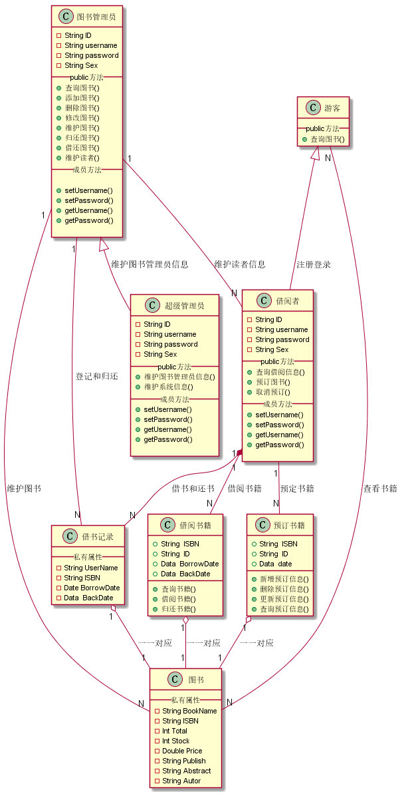
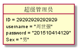
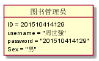
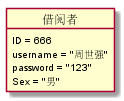
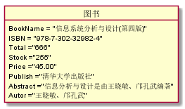
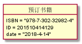
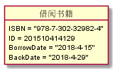
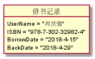

### [返回主页面](../README.md)
周世强的第三次实验报告             
============
|班级|姓名|学号|
|:---------------:|:------------:|:------------:|
|软件工程一班|周世强|201510414129|
## 实验三：图书管理系统领域对象建模
### 1.图书管理系统类图

**1.1PlantUML源码如下：**

@startuml

class 超级管理员 {
		-String ID
	 	-String username
	 	-String password
		-String Sex
		__public方法__
	 	+维护图书管理员信息()
		+维护系统信息()
		__成员方法__
		+ setUsername()
 		+ setPassword()
		+ getUsername()
 		+ getPassword()
 		
	}
class 图书管理员 {
		-String ID
	 	-String username
	 	-String password
		-String Sex
		__public方法__
		+查询图书()
		+添加图书()
		+删除图书()
		+修改图书()
		+维护图书()
		+归还图书()
		+借还图书()
		+维护读者()
		__成员方法__
		 + setUsername()
 		+ setPassword()
		+ getUsername()
 		+ getPassword()
 		}   
    class 借阅者 {
        -String ID
	 	-String username
	 	-String password
		-String Sex
		__public方法__
		+查询借阅信息()
		+预订图书()
		+取消预订()
		__成员方法__
		+ setUsername()
 		+ setPassword()
		+ getUsername()
 		+ getPassword()
 		}
	class 游客 {
		__public方法__
		+查询图书()
	}
	class 图书 {
		__ 私有属性 __
	 	-String BookName
	 	-String ISBN
	 	-Int Total
	 	-Int Stock
	 	-Double Price
	 	-String Publish
	 	-String Abstract
	 	-String Autor
	}
	class 预订书籍{
    +String  ISBN
    +String  ID
    +Data  date
    +新增预订信息()
    +删除预订信息()
    +更新预订信息()
    +查询预订信息()
}
class 借阅书籍{
    +String  ISBN
    +String  ID
    +Data  BorrowDate
    +Data  BackDate
    +查询书籍()
    +借阅书籍()
    +归还书籍()
}
class 借书记录 {
		__ 私有属性 __
	 	-String UserName
	 	-String ISBN
	 	-Date BorrowDate
	 	-Data  BackDate}
	图书管理员 <|-- 超级管理员 : 维护图书管理员信息
	游客 <|-- 借阅者 : 注册登录
	图书管理员 "1" -- "N" 借阅者 : 维护读者信息
	图书管理员 "1" -- "N" 图书 : 维护图书
	借书记录 "1" o-- "1" 图书 : 一一对应
	借书记录 "N" -- "1" 图书管理员 : 登记和归还
	借阅者 "1" -- "N" 预订书籍 : 预定书籍
	借阅者 "1" -- "N" 借阅书籍 : 借阅书籍
	借阅者 "1" *-- "N" 借书记录 : 借书和还书
	预订书籍 "1" o-- "1" 图书 : 一一对应
	借阅书籍 "1" o-- "1" 图书 : 一一对应
	游客 "N" -- "N" 图书 : 查看书籍
@enduml

**1.2类图如下：**

### 2.图书管理系统对象图

**2.1超级管理员对象**

   object 超级管理员 
    {
        ID = 29292929292929
		 username = "周世强"
		 password = "201510414129"
         Sex = "男"
    }

图：
    

**2.2图书管理员对象**

   object 图书管理员 
      {
            ID = 201510414129
	    	 username = "周世强"
	    	 password = "201510414129"
            Sex = "男"
        }
图：
    

**2.3借阅者对象**
    object 借阅者
     {
        ID = 666
		 username = "周世强"
		 password = "123"
         Sex = "男"
	}
图：
    

**2.4游客对象**
     object 游客
    {
     }
图：
    

 **2.5图书对象**

  object 图书
     {
        BookName = "信息系统分析与设计(第四版)"
       ISBN = "978-7-302-32982-4"
       Total ="666"
       Stock ="255"
       Price ="45.00"
       Publish ="清华大学出版社"
       Abstract ="信息分析与设计是由王晓敏、邝孔武编著"
       Autor ="王晓敏、邝孔武"
	}
图：
    

**2.6预订书籍对象**

   object 预订书籍
      {
       ISBN = "978-7-302-32982-4"
       ID = 201510414129
       date = 2018-4-14
	}
图：
     

 **2.7借阅书籍对象**

   object 借阅书籍
      {
        ISBN = "978-7-302-32982-4"
        ID = 201510414129
         BorrowDate = "2018-4-15"
         BackDate ="2018-4-29"
	    }
图：
    

**2.8借书记录对象** 

   object 借书记录
     {
        UserName = "周世强"
       ISBN = "978-7-302-32982-4"
       ID = 201510414129
       BorrowDate = "2018-4-15"
       BackDate ="2018-4-29"
	}
图：
    

