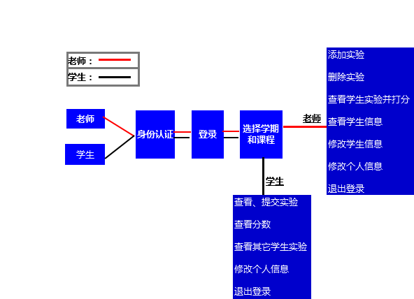
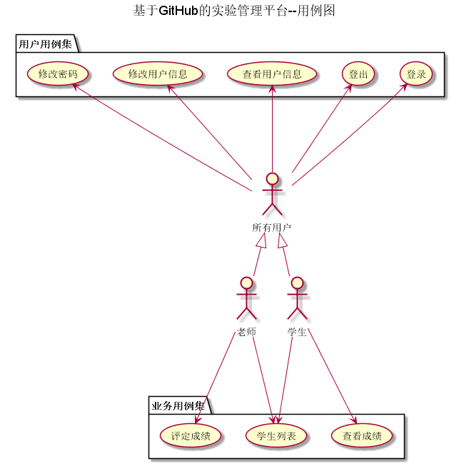
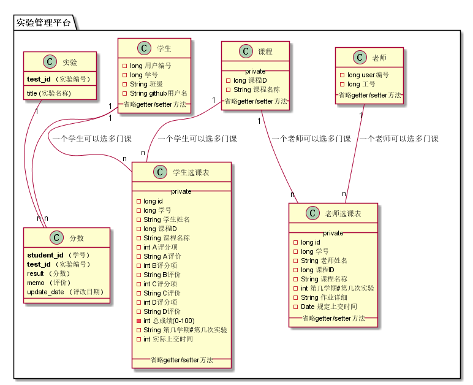

### [返回主页面](../README.md)
# 基于GitHub的实验管理平台的分析与设计

### 成都大学信息科学与工程学院

#周世强的第六次实验报告   

============
|班级|姓名|学号|
|:---------------:|:------------:|:------------:|
|软件工程一班|周世强|201510414129|
============
## 1. 概述
*   基于GitHub的学生成绩管理系统，主要功能对于老师是提供评定学生本课程成绩；  
所以本系统用户分为老师和学生。
老师具有评定学生本学科各个实验成绩(多评分点)、给予实验评价等功能；
学生具有查看学生本人所有课程实验成绩及评价等功能。  
    
## 2. 系统总体结构
*    
    1.  老师：  
    *   认证->登录->选择学期->查看，添加，删除实验；批改作业；修改信息
    2.  学生：  
    *  认证->登录->选择学期->查看作业，分数，修改个人信息。

*   具体结构见系统结构图:  
**系统结构图 **

    
## 3. 用例图设计[源码](./src/UseCase.puml)

## 4. 类图设计[源码](./src/class.puml)

## 5. 数据库设计
- ### [参见数据库设计](./数据库表/数据库表.md)
     
## 6. 界面及用例详细设计

### [“登录”用例](./用例/登录.md),[界面](https://github.com/zhoushiqiang/is_analysis/tree/master/test6/ui/login.html)
### [“注册”用例](./用例/regedit.md),[界面1](https://github.com/zhoushiqiang/is_analysis/tree/master/test6/ui/adminregedit.html),[界面2](https://github.com/zhoushiqiang/is_analysis/tree/master/test6/ui/sturegedit.html)
### [“修改密码”用例](./用例/修改密码.md),[界面](https://agreysky.github.io/is_analysis/test6/src/ui/顶部菜单_html.html)
### [“查看个人信息”用例](./src/用例/查看个人信息.md),[界面](https://agreysky.github.io/is_analysis/test6/src/ui/顶部菜单_html.html)
### [“修改个人信息”用例](./src/用例/修改个人信息.md),[界面](https://agreysky.github.io/is_analysis/test6/src/ui/顶部菜单_html.html)
### [“选择学期”用例](./src/用例/选择学期.md),[界面](https://agreysky.github.io/is_analysis/test6/src/ui/选择学期_html.html)
### [“显示课程列表”用例](src/用例/查看课程列表.md),[界面](https://agreysky.github.io/is_analysis/test6/src/ui/查看课程列表_html.html)
### [“查看课程信息”用例](./src/用例/查看课程信息.md),[界面](https://agreysky.github.io/is_analysis/test6/src/ui/查看课程信息_html.html)
### [“查看本课程实验任务”用例](src/用例/查看实验列表.md),[界面](https://agreysky.github.io/is_analysis/test6/src/ui/删改查实验任务（1）_html.html)
### [“查看成绩及评价”用例](src/用例/查看成绩列表.md),[界面](https://agreysky.github.io/is_analysis/test6/src/ui/查看和评定成绩列表_html.html)
### [“选择任教课程”用例](./src/用例/选择任教课程.md),[界面](https://agreysky.github.io/is_analysis/test6/src/ui/顶部菜单_html.html)
### [“显示本课程学生列表”用例](./src/用例/显示本课程学生列表.md),[界面](https://agreysky.github.io/is_analysis/test6/src/ui/显示本课程学生列表_html.html)
### [“评定某学生成绩”用例](./src/用例/评定某学生成绩.md),[界面](https://agreysky.github.io/is_analysis/test6/src/ui/查看和评定成绩列表_html.html)
### [“新增实验信息”用例](./src/用例/新增实验信息.md),[界面](https://agreysky.github.io/is_analysis/test6/src/ui/新增实验信息_html.html)
### [“修改实验信息”用例](./src/用例/修改实验信息.md),[界面](https://agreysky.github.io/is_analysis/test6/src/ui/删改查实验任务（1）_html.html)
### [“删除实验信息”用例](./src/用例/删除实验信息.md),[界面](https://agreysky.github.io/is_analysis/test6/src/ui/删改查实验任务（1）_html.html)
### [“修改课程信息”用例](./src/用例/修改课程信息.md),[界面](https://agreysky.github.io/is_analysis/test6/src/ui/修改课程信息_html.html)
### [“新建课程”用例](./src/用例/新建课程.md),[界面](https://agreysky.github.io/is_analysis/test6/src/ui/新建课程_html.html)
### [“删除课程信息”用例](./src/用例/删除课程信息.md),[界面](https://agreysky.github.io/is_analysis/test6/src/ui/顶部菜单_html.html)

## 7. 参考文献
- 绘制方法参考[PlantUML标准](http://plantuml.com)
- Markdown格式参考：https://www.jianshu.com/p/b03a8d7b1719