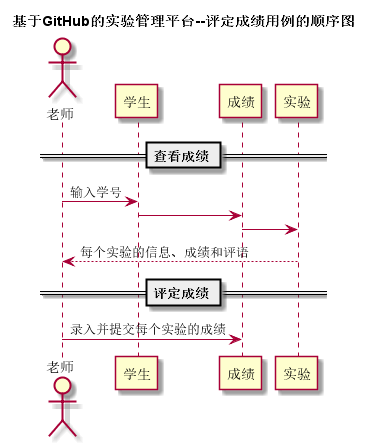

# “评定某学生成绩”用例 [返回](../../README.md)

## 1. 用例规约

|用例名称|评定某学生成绩|
|-------|:-------------|
|功能|评定某个学生的课程、实验、评分点成绩|
|参与者|老师|
|前置条件| 以老师的身份登录成功，能访问该课程|
|后置条件||
|主事件流| 1. 老师从学生列表中选择某个学生 2.系统显示学生成绩列表 3.老师输入某几个成绩和评语并确认|
|备选事件流|1a. 学生GitHub地址出错  &nbsp;&nbsp; 1.系统提示地址错误，老师无需评分   2a. 老师误输入不合法成绩信息  &nbsp;&nbsp; 1.系统提示成绩输入错误  &nbsp;&nbsp; 2.老师重新输入成绩|

## 2. 业务流程
 

## 3. 界面表
- 界面参照: https://aGreySky.github.io/is_analysis/test6/src/ui/查看和评定成绩列表_html.html
- API接口调用
    - 接口1：[setScore](../接口/setScore.md)

## 4. 算法描述 
- 无
    
## 5. 参照表

- [学生表](../数据库表/数据库表.md/#STUDENTS)
- [课程表](../数据库表/数据库表.md/#COURSES)